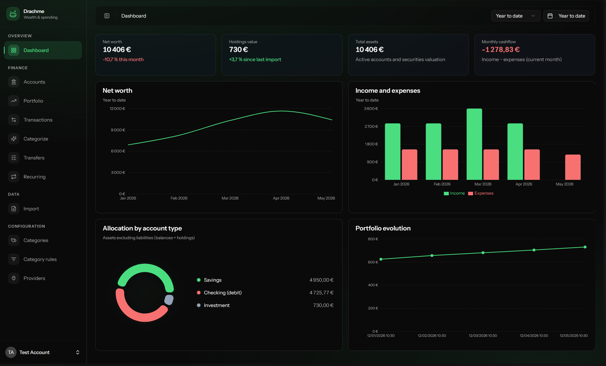
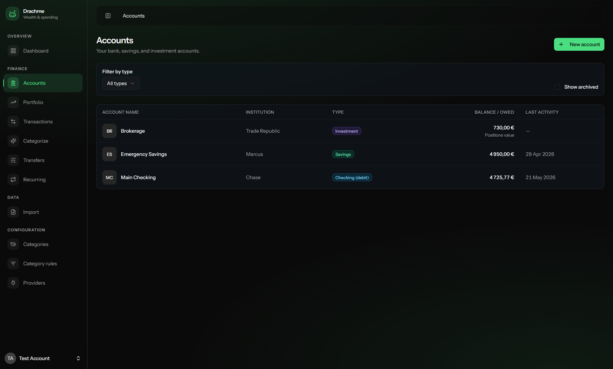
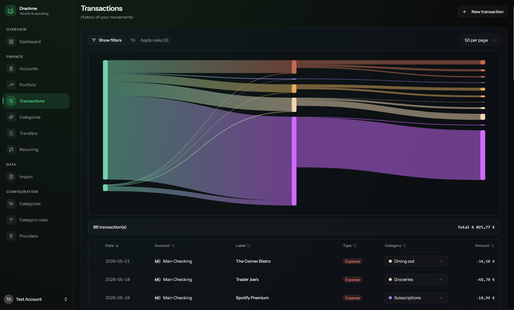
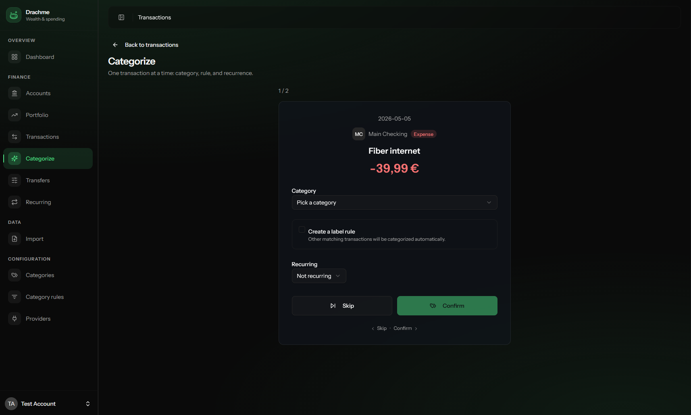
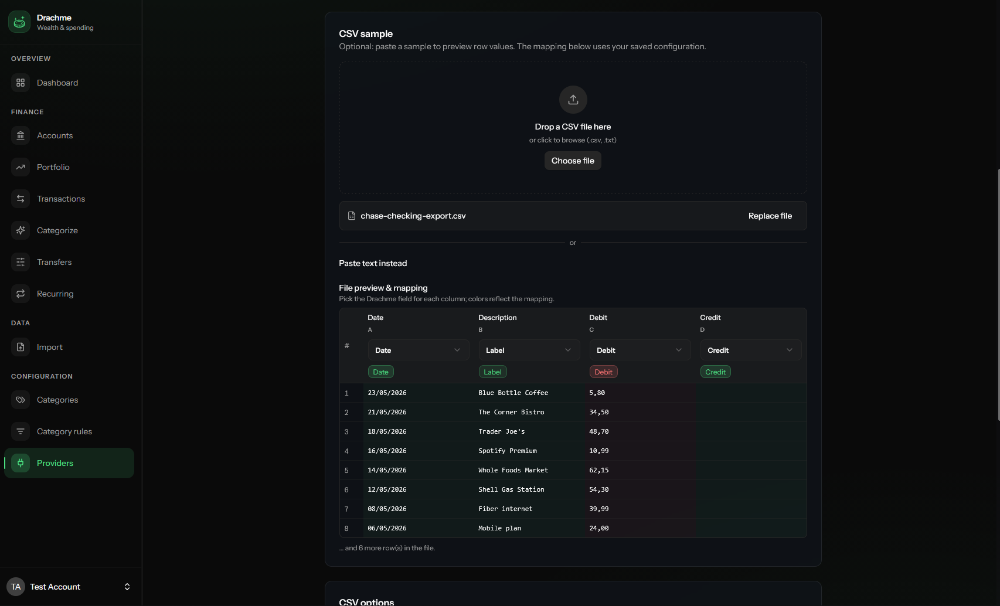
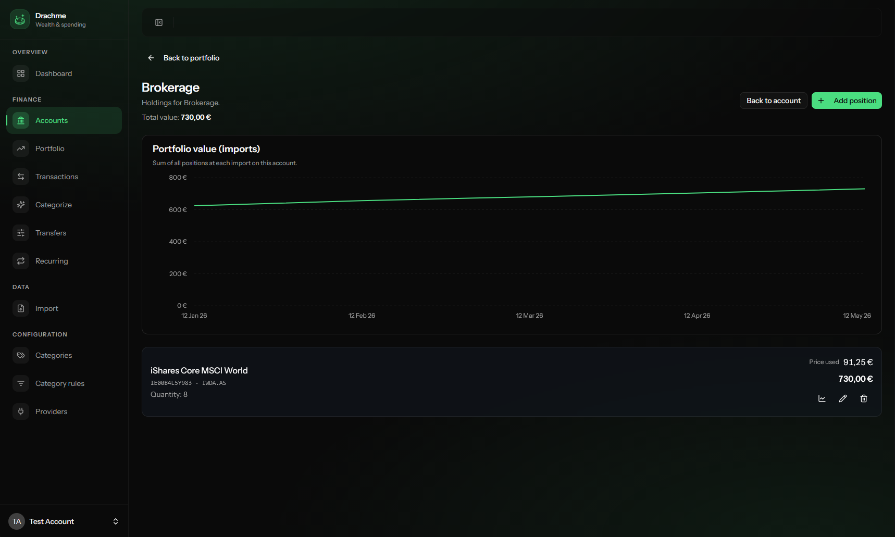

# Drachme 💰

[](LICENSE)
[](https://www.php.net/)
[](https://laravel.com/)
[](https://react.dev/)

**Drachme** is a self-hosted app to track net worth, cashflow, bank imports, and investments. 🪙

Your data stays on your machine. There is no telemetry, no third-party analytics, and no cloud account required.

## About this project

This is a **personal hobby project** built for my own needs. I use it day to day to manage my finances, and I am sharing the code in case it helps someone else.

For now, Drachme is meant to stay a **hobby project**:

- It runs as a **small local Docker stack** on your machine (not a hosted SaaS).
- I do **not** plan to ship a native desktop or mobile app at this time.
- Feature scope follows what I actually need; there is no pressure to match commercial products. See [Planned improvements](#planned-improvements) for ideas I may explore later.

If that fits your use case, you are welcome to try it, fork it, or contribute. See [CONTRIBUTING.md](CONTRIBUTING.md).

> **Not financial advice.** Drachme helps you organize your own records. It is not a regulated financial product.

## Screenshots

| Dashboard | Accounts |
| --- | --- |
|  |  |

| Transactions | Categorize |
| --- | --- |
|  |  |

| Import | Investments |
| --- | --- |
|  |  |

## Features

### Accounts and balances

- Account types: checking, savings, investment, credit, loan, credit card, and cash
- Per-user isolation (multi-tenant): each login has its own data space
- Credit card settlement sync with checking accounts
- Loan accounts with payment day, amortization plan, and debt metrics

### Transactions and categories

- Global transaction list with filters, Sankey cashflow view, and inline category editing
- Manual transaction CRUD
- Category tree and automatic rules (label matching)
- Optional field-level encryption for transaction labels and notes (CipherSweet)

### Automation and smart workflows

Drachme includes several helpers to reduce manual bookkeeping after imports:

#### Easy categorization

- **Triage queue**: focus on uncategorized transactions one by one, with keyboard-friendly actions
- **Category rules**: match labels automatically (create rules from a transaction label in one click)
- **Bulk apply rules**: run all rules against uncategorized rows from the transaction list
- **Inline edits**: change a category directly in the list; optionally create a rule for similar labels

#### Internal transfer detection

- Scans uncategorized movements for **matching amounts** on different accounts within a short date window
- Suggests likely **internal transfer pairs** (e.g. checking → savings)
- Accept to link them as a transfer, or dismiss false positives

#### Recurring pattern detection

- Detects **monthly and bi-weekly** patterns from transaction history (same label, stable amount)
- Suggests subscriptions, rent, salary, and similar recurring items
- Confirm with category and frequency, or dismiss; confirmed patterns appear in the recurring overview

### Imports

- Configurable CSV import providers per user
- Column mapping wizard with preview and duplicate handling

### Investments

- Portfolio positions with ISIN support
- Manual price and history refresh
- Market data via **Yahoo Finance** (quotes and ~100-day history)
- ISIN to symbol resolution via **OpenFIGI** (no API key required; optional key improves rate limits)
- Portfolio overview and position detail pages

### Dashboard

- Net worth KPIs and history with date range
- Cashflow chart aligned with transaction list filters
- Portfolio evolution and account allocation drill-down

### UX

- Dark theme by default, customizable primary color
- English and French UI
- Built with [shadcn/ui](https://ui.shadcn.com/), Inertia.js, and Tailwind CSS 4

## Planned improvements

This is a hobby project, so priorities change with real usage. Ideas on the radar:

| Area | Direction |
| --- | --- |
| **AI assistant** | Connect an AI agent (local or API) so you can ask questions about your spending, e.g. “How much did I spend on groceries last quarter?” or “Which subscriptions increased this year?”, grounded in your own data, without sending telemetry elsewhere by default. |
| **More import formats** | Additional bank/broker presets and smarter duplicate detection |
| **Reporting** | Deeper budget vs. actual views built on categories and recurring patterns |

Nothing here is committed or scheduled. If you want to contribute, open an issue or PR; see [CONTRIBUTING.md](CONTRIBUTING.md).

## Tech stack

| Layer | Technology |
| --- | --- |
| Backend | PHP 8.4, Laravel 13, Fortify |
| Frontend | React 19, Inertia.js, TypeScript (strict) |
| Database | PostgreSQL 16 (Docker) |
| Quality | PHPStan/Larastan level 8, ESLint, PHPUnit |
| Runtime | Docker Compose |

## Quick start

### Prerequisites

- [Docker](https://docs.docker.com/get-docker/) with Compose v2
- Git

### Install

```bash
git clone https://github.com/adrien-force/Drachme.git
cd Drachme

make normalize   # line endings (helpful on Windows/WSL)
make check       # verify Docker is available

make bootstrap   # first time only: scaffold Laravel + frontend
make build && make up
make setup       # .env, composer, npm, migrations, assets
```

Open **http://localhost:8080** and register your first user.

Optional hot reload for frontend assets:

```bash
make dev   # Vite on http://localhost:5173
```

### Common commands

```bash
make logs
make migrate
make build-assets   # after PHP route changes (Wayfinder)
make quality        # PHPStan 8 + TypeScript + tests
make down
```

## Configuration

Copy environment defaults from `.env.example` and adjust as needed.

| Variable | Description |
| --- | --- |
| `APP_KEY` | `php artisan key:generate` |
| `CIPHERSWEET_KEY` | Required for encrypted transaction labels: `php artisan ciphersweet:generate-key` |
| `DB_*` | PostgreSQL connection (Docker Compose sets host to `pgsql`) |
| `MARKET_DATA_ENABLED` | Enable/disable market price refresh (default `true`) |
| `MARKET_DATA_CACHE_TTL` | Cache TTL in seconds for quotes |
| `MARKET_DATA_HISTORY_LIMIT` | Days of price history to fetch |
| `OPENFIGI_API_KEY` | Optional. Raises OpenFIGI rate limits |

Market data calls are logged to `storage/logs/laravel.log` (channel `market_data`). Failures never break the refresh action.

## Development

```bash
make shell          # app container
make test
make analyse        # PHPStan level 8
make typecheck      # tsc --noEmit
```

CI runs on push/PR: see [.github/workflows/tests.yml](.github/workflows/tests.yml) and [.github/workflows/lint.yml](.github/workflows/lint.yml).

## Security and privacy

- Self-hosted: you control the server and database backups
- Session-based authentication (email + password)
- Sensitive transaction fields can be encrypted at rest with CipherSweet
- No outbound telemetry from the application

To report a security issue, see [SECURITY.md](SECURITY.md).

## Contributing

Contributions are welcome under the terms of the [AGPL-3.0](LICENSE) license. See [CONTRIBUTING.md](CONTRIBUTING.md).

## License

Copyright (c) Adrien Force

This project is licensed under the **GNU Affero General Public License v3.0 or later**. See [LICENSE](LICENSE).

If you run a modified version as a network service, you must offer corresponding source to users interacting with it over the network.
